<p align="center">
  <picture>
    <source media="(prefers-color-scheme: dark)" srcset="assets/omahub-hero-dark.svg">
    <source media="(prefers-color-scheme: light)" srcset="assets/omahub-hero-light.svg">
    
  </picture>
</p>

<p align="center">The Mac layer for Omarchy. One key for everything you want to change.</p>

<p align="center">
  
</p>

# Omahub

Omahub turns SUPER + A into the place where you set up, tune, and extend Omarchy. It brings the details people love about the Mac to a system that stays pure Omarchy underneath: every change runs through Omarchy's own commands, follows your theme, and can be undone.

Every setting in Omahub is a small, readable file. People change them from the hub, agents change them from the terminal, and contributors add new ones with a single file and a test.

## Today

| | What it does |
|---|---|
| The hub | SUPER + A opens it. Search every setting, move with j and k, change it with Space. Every row shows the real state of your system. The first time it loads, a welcome offers the settings recommended for your keyboard |
| Keyboard | Detects your keyboard and recommends keys for it: Mac screenshots, Vim focus, agent keys, and mouse buttons. No Omarchy action loses its key |
| Agents | Turn on "Let agents use Omahub" and any coding agent can read and change these settings through the `omahub` command |
| [Omahub Capture](https://github.com/elberacasa/omahub-capture) | A thumbnail after every screenshot. Click to edit, drag into any app, drag right to throw away, right-click to save it anywhere |

## Building now

- **More sections.** Appearance and plugins, each one a folder of setting files.

## Install

```bash
omarchy plugin add https://github.com/elberacasa/omahub.git --enable
omarchy restart shell
```

Add the screenshot thumbnail too:

```bash
omarchy plugin add https://github.com/elberacasa/omahub-capture.git --enable
omarchy restart shell
```

Plugins land disabled until you enable them, so you can read the code first. Omahub never uses sudo. Anything that needs your password opens in a visible terminal.

## Keyboard

Installing Omahub never changes your keybindings. Omahub detects your keyboard, recommends the keys that fit it, and makes every keyboard change a setting you can turn off again:

```bash
omahub=~/.config/omarchy/plugins/io.github.elberacasa.omahub/bin/omahub

$omahub get keyboard/size          # your keyboard and the settings it recommends
$omahub set keyboard/vim-focus on  # turn a setting on
$omahub reset keyboard/vim-focus   # and back to Omarchy's keys
$omahub settings                   # everything you can change
```

| Setting | What it does | Recommended for |
|---|---|---|
| `keyboard/omahub-key` | SUPER + A opens Omahub | Every keyboard |
| `keyboard/mac-screenshot-keys` | SUPER + SHIFT + 3, 4, and 5 take screenshots, like a Mac | Every keyboard |
| `keyboard/agent-keys` | Agent on SUPER + SHIFT + A, browser on SUPER + B, dictation on SUPER + R | Every keyboard |
| `keyboard/vim-focus` | H, J, K, and L focus, swap, and group windows wherever Omarchy uses arrows | 60% and 65% keyboards |
| `keyboard/mouse-buttons` | Hold SUPER and press a mouse side button to take a screenshot or start dictation | Mice with side buttons |

Every Omarchy action these settings take a key from moves to a new one:

| Action | Omarchy | With Omahub |
|---|---|---|
| Move window to workspace | SUPER + SHIFT + number | SUPER + ALT + number |
| Switch to group window | SUPER + ALT + 1 to 5 | SUPER + CTRL + ALT + 1 to 5 |
| Agent | SUPER + SHIFT + CTRL + A | SUPER + SHIFT + A |
| ChatGPT | SUPER + SHIFT + A | SUPER + SHIFT + CTRL + A |
| Toggle window split | SUPER + J | SUPER + SHIFT + ALT + J |
| Toggle workspace layout | SUPER + L | SUPER + SHIFT + ALT + L |
| Keybindings | SUPER + K | SUPER + / |
| Tmux keybindings | SUPER + ALT + K | SUPER + ALT + / |
| Herdr keybindings | SUPER + CTRL + K | SUPER + CTRL + / |
| Monitor scaling up and down | SUPER + / and SUPER + ALT + / | SUPER + CTRL + ALT + = and - |

After every change, Omahub compares the actions Omarchy has keys for before and after, and undoes the change if any action lost its key. It edits one marked block in `~/.config/hypr/bindings.lua` and backs the file up first. With Omahub Capture installed, the screenshot keys show the floating thumbnail.

## Principles

- **Omarchy is the source of truth.** Omahub calls Omarchy's commands and reads its data. It never reimplements installs, themes, or captures.
- **Your theme, always.** Every color, radius, and font comes from the active Omarchy theme.
- **Nothing changes until you ask.** Installing never touches your config. Every change is one command to undo.
- **Motion with purpose.** Transitions are short, calm, and reviewed frame by frame before they ship.

## Development

Clone into your projects folder, then sync it into the plugins folder the shell watches:

```bash
dev/sync --restart   # copy the working tree and restart the shell
dev/sync --watch     # keep copying on every save
omarchy plugin validate .
test/all                 # run every test against a disposable home
```

To add a setting, read [docs/settings.md](docs/settings.md).

Plugins with `keepLoaded: true` only pick up QML changes after a shell restart.

Record and review motion:

```bash
dev/take thumbnail 7 --quiet --run "<command that triggers the animation>"
dev/frames tmp/takes/thumbnail.mp4 0.4 1.0 --fps 60
dev/export-media tmp/takes/thumbnail.mp4 thumbnail 0.4-6.5
```

`dev/take` records the focused monitor with notifications silenced. `dev/frames` tiles every frame of a window into one image. `dev/export-media` cuts segments into an MP4 and a GIF.

## Contributing

Bug reports, ideas, and pull requests are welcome. Read [CONTRIBUTING.md](CONTRIBUTING.md) to get set up and [AGENTS.md](AGENTS.md) for the conventions this project follows, which are Omarchy's own. Everyone taking part follows the [Code of Conduct](CODE_OF_CONDUCT.md). Report security issues privately as described in [SECURITY.md](SECURITY.md).

## Remove

Turn off any keyboard settings first with `$omahub reset keyboard/<name>`, then:

```bash
omarchy plugin remove io.github.elberacasa.omahub
```

## Requirements

Omarchy 4.0 or newer. The development tools also use `ffmpeg` and `gpu-screen-recorder`, which ship with Omarchy.

## License

MIT
